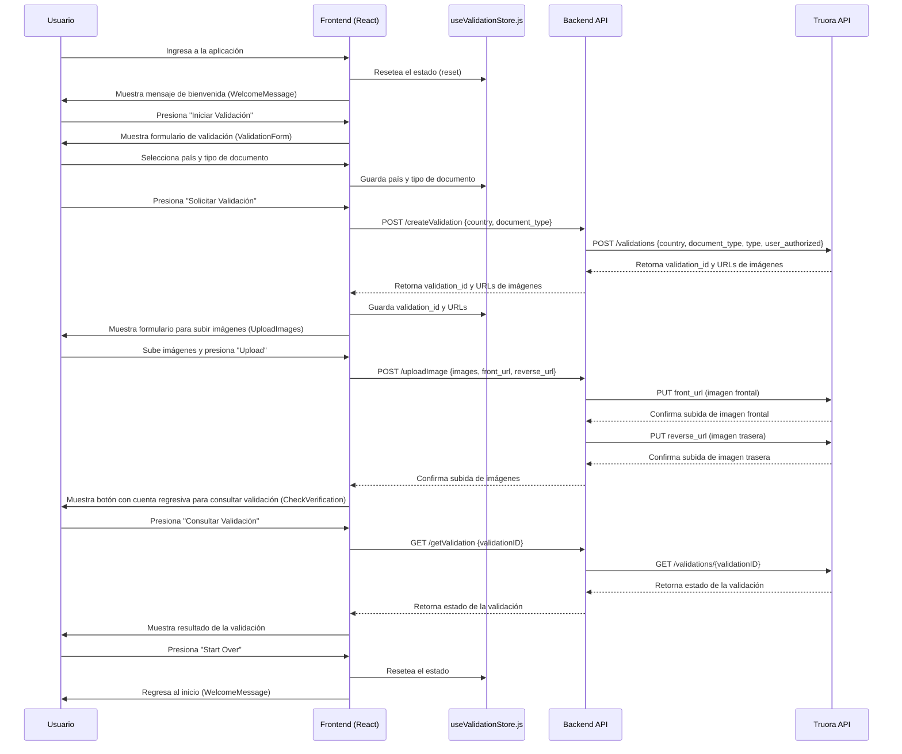

# Document Validation App

## Descripción

Esta aplicación web permite a los usuarios validar sus documentos de identidad a través de un flujo de pasos guiados, interactuando con un servicio de validación externo. El frontend está construido con React, utilizando Vite para la configuración del proyecto, y Zustand para la gestión del estado global. El backend se encarga de la comunicación con el servicio de validación de documentos de Truora y la gestión de las cargas de imágenes.

## Dependencias

### Frontend

- **React**: Biblioteca para la construcción de interfaces de usuario.
- **Axios**: Cliente HTTP para realizar solicitudes al backend.
- **Zustand**: Biblioteca para la gestión de estados en aplicaciones de React.
- **Tailwind CSS**: Framework de CSS para el diseño de la interfaz de usuario.
- **Vite**: Herramienta de construcción rápida para proyectos de frontend.

### Backend

- **Node.js**: Entorno de ejecución para JavaScript.
- **Express**: Framework para la creación de servidores web.
- **Axios**: Cliente HTTP para interactuar con la API de Truora.
- **Multer**: Middleware para la gestión de archivos en las solicitudes.
- **Morgan**: Middleware para el registro de solicitudes HTTP.
- **Cors**: Middleware para habilitar CORS.
- **Dotenv**: Carga de variables de entorno desde un archivo `.env`.

## Estructura de Archivos

### Frontend

```plaintext
├── src
│   ├── components
│   │   ├── WelcomeMessage.jsx
│   │   ├── ValidationForm.jsx
│   │   ├── UploadImages.jsx
│   │   └── CheckVerification.jsx
│   ├── stores
│   │   └── useValidationStore.js
│   ├── App.jsx
│   └── main.jsx
├── public
│   └── index.html
├── .env
├── tailwind.config.js
├── package.json
├── vite.config.js
└── README.md

```

- `App.jsx`: Componente principal que maneja el flujo de la aplicación y las transiciones entre pasos.
- `useValidationStore.js`: Configuración de Zustand para la gestión del estado global y su persistencia en `localStorage`.
- `WelcomeMessage.jsx`: Componente que muestra el mensaje de bienvenida y el botón para iniciar la validación.
- `ValidationForm.jsx`: Formulario que permite al usuario seleccionar su país y tipo de documento.
- `UploadImages.jsx`: Componente para subir las imágenes del documento.
- `CheckVerification.jsx`: Componente que verifica el estado de la validación después de subir las imágenes.

### Backend

```plaintext
├── server.js
├── routes
│   └── index.js
├── controllers
│   ├── createValidation.js
│   ├── uploadImage.js
│   └── getValidation.js
├── .env
├── package.json
└── README.md
```

- **`server.js`**: Configura el servidor Express, maneja las configuraciones de Axios, y aplica los middlewares como CORS y Morgan.
- **`routes/index.js`**: Define las rutas principales de la API.
- **`controllers/createValidation.js`**: Controlador para crear una nueva validación en Truora.
- **`controllers/uploadImage.js`**: Controlador para manejar la carga de imágenes necesarias para la validación.
- **`controllers/getValidation.js`**: Controlador para obtener el estado de una validación específica.

## Flujo de la Aplicación



## Cómo Ejecutar la Aplicación

### Frontend

1. Instalar las dependencias:

   ```bash
   npm install
   ```

2. Ejecutar la aplicación en modo desarrollo:

   ```bash
   npm run dev
   ```

### Backend

1. Clona el repositorio.
2. Instala las dependencias con:

   ```bash
   npm install
   ```

3. Crea un archivo `.env` en la raíz del proyecto con las siguientes variables:

   ```plaintext
   PORT=3001
   ORIGIN=https://localhost:3000
   API_KEY=tu_api_key
   ```

4. Ejecutar el servidor:

   ```bash
   npm start
   ```

El servidor estará corriendo en `http://localhost:3001`.

## Consideraciones

- Asegúrate de que el backend esté corriendo y accesible en `http://localhost:3001`.
- Las imágenes se suben mediante peticiones POST a la API y deben ser manejadas adecuadamente en el backend.
- Asegúrate de que las imágenes se envíen correctamente en formato multipart/form-data.
- Verifica que las URLs y el API Key de Truora estén correctamente configurados en tu archivo `.env`.