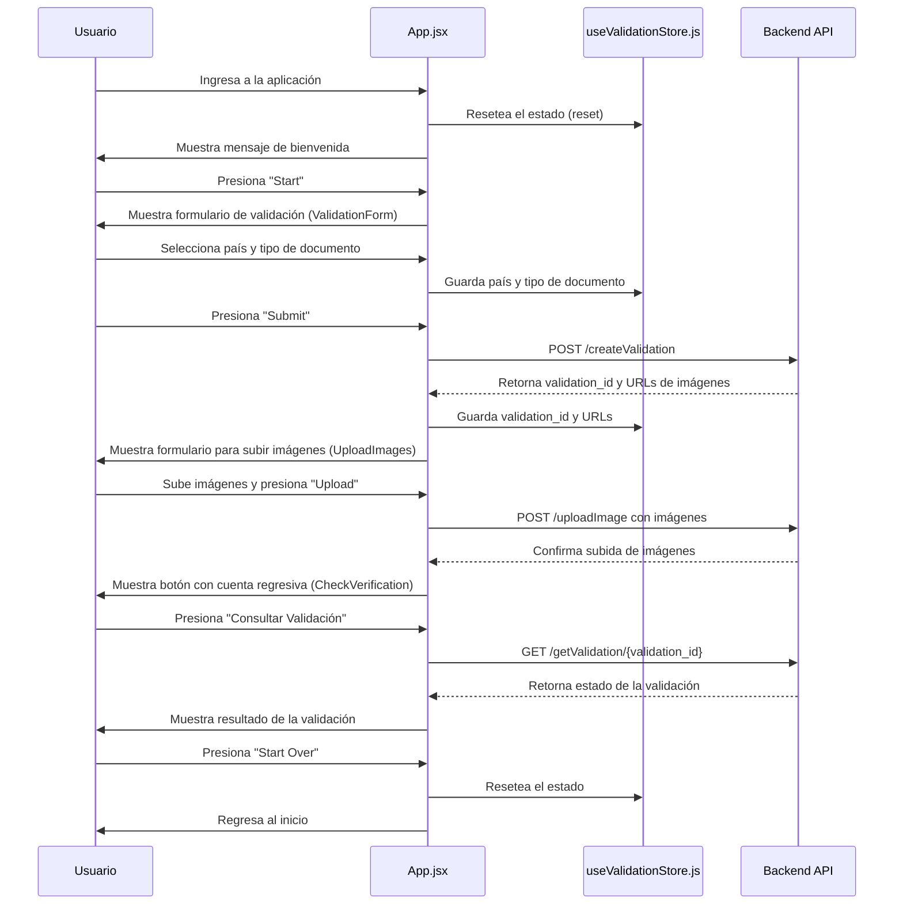

# Document Validation App

## Descripción

Esta aplicación web permite a los usuarios validar sus documentos de identidad a través de un flujo de pasos guiados. El frontend está construido con React, utilizando Vite para la configuración del proyecto, y Zustand para la gestión del estado global. El backend es accesible a través de API utilizando Axios para las solicitudes HTTP.

## Dependencias

- **React**: Biblioteca para la construcción de interfaces de usuario.
- **Axios**: Cliente HTTP para realizar solicitudes al backend.
- **Zustand**: Biblioteca para la gestión de estados en aplicaciones de React.
- **Tailwind CSS**: Framework de CSS para el diseño de la interfaz de usuario.
- **Vite**: Herramienta de construcción rápida para proyectos de frontend.

## Estructura de Archivos

- `package.json`: Define las dependencias y scripts del proyecto.
- `App.jsx`: Componente principal que maneja el flujo de la aplicación y las transiciones entre pasos.
- `useValidationStore.js`: Configuración de Zustand para la gestión del estado global y su persistencia en `localStorage`.
- `WelcomeMessage.jsx`: Componente que muestra el mensaje de bienvenida y el botón para iniciar la validación.
- `ValidationForm.jsx`: Formulario que permite al usuario seleccionar su país y tipo de documento.
- `UploadImages.jsx`: Componente para subir las imágenes del documento.
- `CheckVerification.jsx`: Componente que verifica el estado de la validación después de subir las imágenes.

## Flujo de la Aplicación



## Componentes

### `App.jsx`

Este componente maneja la lógica de navegación entre las distintas vistas de la aplicación. Utiliza el estado `currentStep` para controlar qué componente se debe renderizar.

### `useValidationStore.js`

Gestiona el estado global de la aplicación utilizando Zustand. Este estado incluye información sobre el país seleccionado, tipo de documento, URLs de las imágenes y el `validation_id`. También permite resetear el estado cuando el usuario decide reiniciar el proceso.

### `WelcomeMessage.jsx`

Muestra un mensaje de bienvenida con un botón para iniciar la validación. Este botón avanza al siguiente paso en la aplicación.

### `ValidationForm.jsx`

Formulario que permite al usuario seleccionar su país y el tipo de documento que desea validar. También determina si el documento requiere la carga de imágenes de ambos lados.

### `UploadImages.jsx`

Componente que maneja la carga de imágenes de los documentos. En función del tipo de documento seleccionado, permite subir una o dos imágenes.

### `CheckVerification.jsx`

Componente que verifica el estado de la validación después de un breve periodo de espera. Permite al usuario revisar el estado de la validación y reiniciar el proceso si lo desea.

## Cómo Ejecutar la Aplicación

1. Instalar las dependencias:

   ```bash
   npm install
   ```

2. Ejecutar la aplicación en modo desarrollo:

   ```bash
   npm run dev
   ```

## Notas

- Asegúrate de que el backend esté corriendo y accesible en `http://localhost:3001`.
- Las imágenes se suben mediante peticiones POST a la API y deben ser manejadas adecuadamente en el backend.