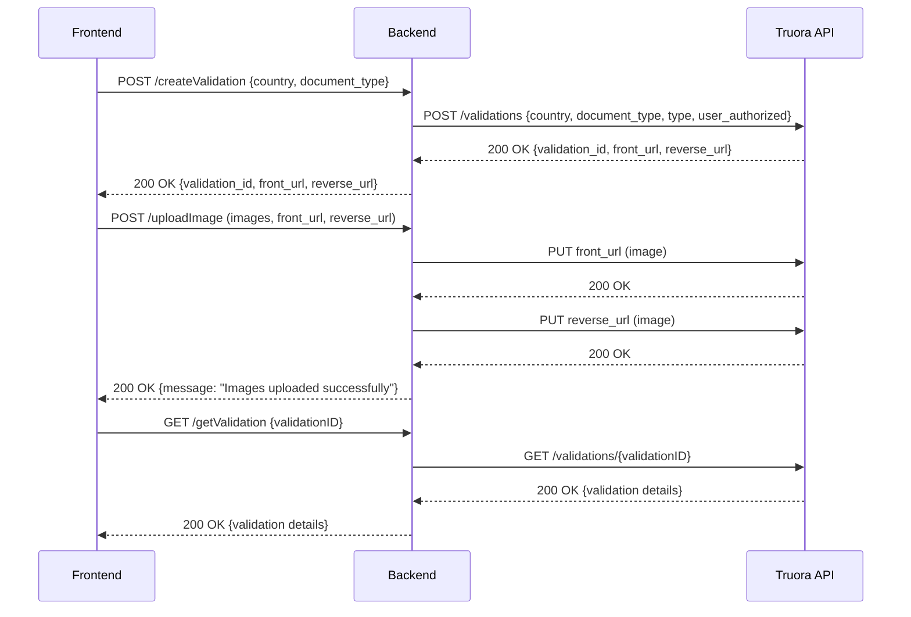

# Documentación del Proyecto

## Descripción

Este proyecto es una API backend que interactúa con el servicio de validación de documentos de Truora. Permite la creación de validaciones de documentos, la carga de imágenes para completar la validación, y la consulta del estado de una validación.

### Requisitos

- Node.js
- Express
- Axios
- Multer
- Morgan
- Cors
- Dotenv

## Configuración del Proyecto

### Instalación

1. Clona el repositorio.
2. Instala las dependencias con:

   ```bash
   npm install
   ```

3. Crea un archivo `.env` en la raíz del proyecto con las siguientes variables:

   ```plaintext
   PORT=3001
   ORIGIN=https://localhost:3000
   API_KEY=tu_api_key_de_truora
   ```

### Ejecución del Servidor

Para ejecutar el servidor, usa el siguiente comando:

```bash
npm start
```

El servidor estará corriendo en `http://localhost:3001`.

## Estructura del Proyecto

```plaintext
├── server.js
├── routes
│   └── index.js
├── controllers
│   ├── createValidation.js
│   ├── uploadImage.js
│   └── getValidation.js
├── .env
├── package.json
└── README.md
```

### Archivos Clave

- **`server.js`**: Configura el servidor Express, maneja las configuraciones de Axios, y aplica los middlewares como CORS y Morgan.
- **`routes/index.js`**: Define las rutas principales de la API.
- **`controllers/createValidation.js`**: Controlador para crear una nueva validación en Truora.
- **`controllers/uploadImage.js`**: Controlador para manejar la carga de imágenes necesarias para la validación.
- **`controllers/getValidation.js`**: Controlador para obtener el estado de una validación específica.

## Rutas de la API

### POST `/createValidation`

- **Descripción**: Crea una nueva validación en Truora y devuelve los URLs para cargar las imágenes necesarias.
- **Parámetros del Body**:
  - `country`: Código de país.
  - `document_type`: Tipo de documento.
- **Respuesta Exitosa (200)**:
  - `validation_id`: ID de la validación.
  - `front_url`: URL para cargar la imagen frontal del documento.
  - `reverse_url`: URL para cargar la imagen trasera del documento.
- **Respuesta de Error (400)**:
  - `error`: Mensaje de error.

### POST `/uploadImage`

- **Descripción**: Sube dos imágenes (frontal y trasera) necesarias para la validación.
- **Parámetros del Body**:
  - `front_url`: URL para cargar la imagen frontal.
  - `reverse_url`: URL para cargar la imagen trasera.
- **Archivos**:
  - `images`: Arreglo de dos imágenes (frontal y trasera).
- **Respuesta Exitosa (200)**:
  - `message`: "Images uploaded successfully".
- **Respuesta de Error (400 | 500)**:
  - `error`: Mensaje de error.

### GET `/getValidation`

- **Descripción**: Obtiene el estado de una validación existente en Truora.
- **Parámetros del Body**:
  - `validationID`: ID de la validación.
- **Respuesta Exitosa (200)**:
  - Detalles de la validación.
- **Respuesta de Error (400)**:
  - `error`: Mensaje de error.

## Flujo Secuencial del Backend



## Consideraciones

- **Errores Comunes**:
  - Asegúrate de que las imágenes se envíen correctamente en formato multipart/form-data.
  - Verifica que las URLs y el API Key de Truora estén correctamente configurados en tu archivo `.env`.